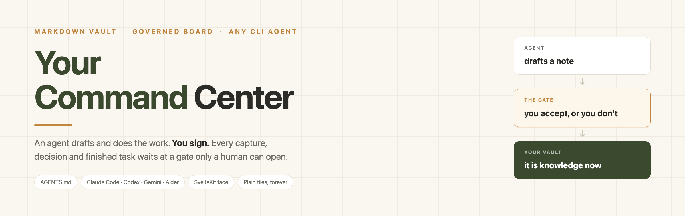
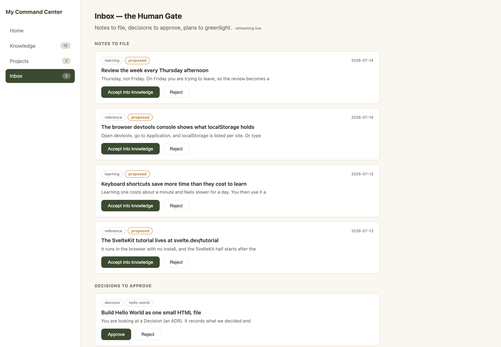
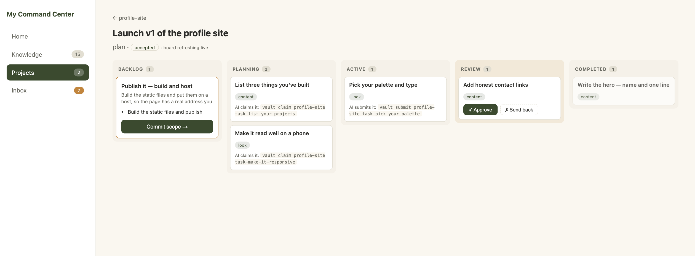
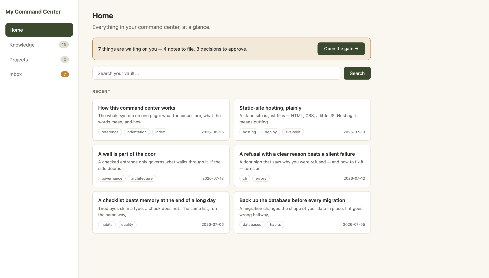
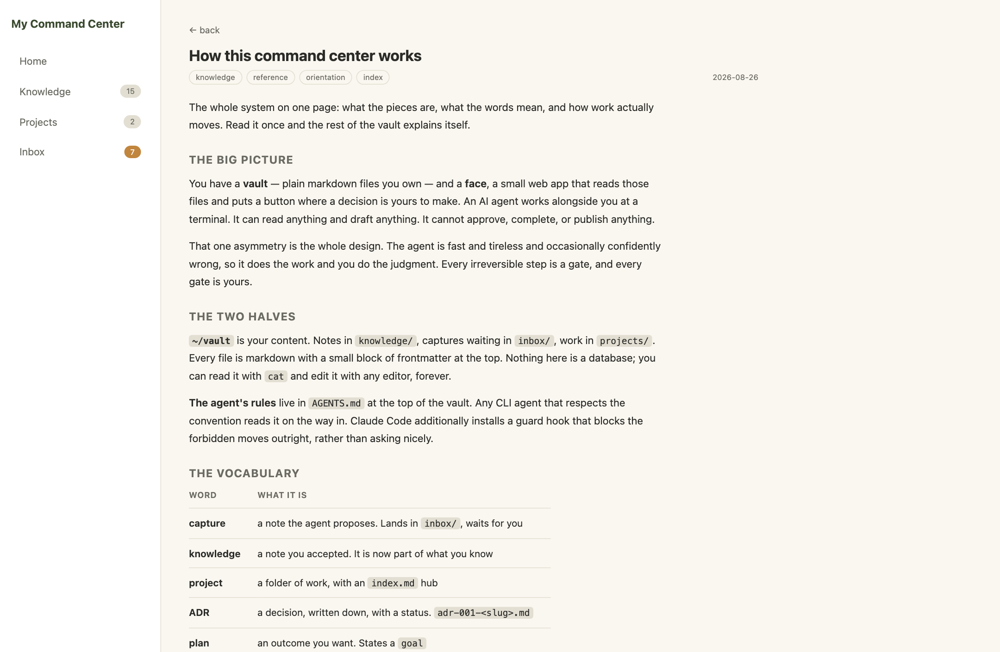

<p align="center">
  
</p>

<p align="center">
  
  
  
  
  
</p>

# Your Command Center

A markdown vault you own — your knowledge and your projects — with a small web
face over it that enforces one rule: **an AI agent drafts and does the work, you
sign.** Every capture, decision, plan and finished task waits at a gate only a
human can open.

It works with whatever CLI agent you use. The rules live in `AGENTS.md`, the file
Codex, Cursor, Gemini CLI, Aider and Claude Code all read.

The repo root **is** the vault. The installer copies it to `~/vault`; the face
lives in `frontend/`.

**[Install](#install)** · **[What it looks like](#what-it-looks-like)** ·
**[Who is allowed to do what](#who-is-allowed-to-do-what)** ·
**[What's inside](#whats-inside)** · **[Configuration](#configuration)**

## Install

```bash
git clone https://github.com/jneaimi/command-center-starter-final.git
bash command-center-starter-final/install.sh
```

That is the whole thing. It checks the machine first and stops with a plain
sentence if something is missing, places the vault, wires whichever agent you
have, puts `vault` on your PATH, and prints a pass/fail block.

```
--dir <path>    put the vault somewhere other than ~/vault
--no-agent      skip the Claude Code extras even if Claude Code is installed
```

Nothing is ever deleted. An existing `~/vault` moves to
`~/archive/vault-backup-<timestamp>`, and any `~/.claude` files it replaces are
copied to `~/archive/dot-claude-backup-<timestamp>` first.

Then, in two places:

```bash
# point your agent at it — open a NEW terminal first, for the PATH
cd ~/vault && claude          # or codex · gemini · aider · cursor

# open its face
cd ~/vault/frontend && npm install && npm run dev   # http://localhost:5180
```

Windows: run the same steps inside WSL (Ubuntu). New here? Start at
`knowledge/how-this-works.md` — the whole model on one page.

## What it looks like

Four screens, all of it reading the markdown files next to it.

### The inbox — where a draft becomes yours

Notes the agent captured, decisions it proposed, plans waiting to be greenlit.
Nothing below has happened yet; each card is a proposal with your name on the
button.



### The board — who is allowed to move each card

Backlog to Completed, one column per status. The agent claims and submits from
the terminal; the two buttons in **Review** are yours and only yours, and the
card tells you the exact command it used to get there.



### Home — what is waiting on you

The gate is on the front door, so nothing sits unread in a folder you never open.



### A note — plain markdown, rendered



### Requirements

| Need | Why |
|---|---|
| `bash`, `git` | the installer, the doorway, the doctor |
| Node **≥ 18.13** | the web face (`@sveltejs/kit` needs `>=18.13`, `vite` wants `^18 \|\| >=20`) |
| `python3` *or* Node | the Claude Code guard reads tool calls with one of them. It prefers python3, falls back to Node, and refuses everything if it has neither |
| a CLI agent | optional. The vault is perfectly usable alone; the agent is the half that drafts |

The installer checks all of this before it touches anything.

## Who is allowed to do what

Three layers hold the same rules, and they are deliberately not equally strong.
Knowing which is which is the point.

| Layer | Covers | Strength |
|---|---|---|
| `AGENTS.md` in the vault | every agent | convention — it is told, in the file it reads |
| `bin/vault` checks its caller | every agent | a speed bump — the gates refuse a non-interactive or known-agent caller |
| The Claude Code hook | Claude Code | a wall — the call is blocked before it runs |

`setup/README.md` explains each one, and how to port the hook to another agent.
The web face is the surface where a human signs, and it is the one thing a
terminal cannot spoof.

### How the work moves

| Move | Who | Where |
|---|---|---|
| Accept a captured note (`inbox/` → `knowledge/`) | human | the inbox |
| Approve a decision (ADR → accepted) | human | the inbox, or the ADR's own page |
| Commit a plan — only once its decision is accepted | human | the board |
| Commit a scope → all its tasks move to planning | human | the board |
| Claim a task (planning → active) | **agent** | `vault claim <project> <task>` |
| Submit a task (active → review) | **agent** | `vault submit <project> <task>` |
| Approve (review → completed), or send back with a reason | human | the board |

The agent can never complete work or approve anything. `vault accept`,
`vault reject`, `vault commit`, `vault done`, `git commit` and `git push` are all
off limits, as are deletes inside the vault, direct file edits into a vault
folder, and hand-edits that would move a task's status. And there is one way in:
`vault capture` always lands in `inbox/`, so nothing reaches `knowledge/` without
passing the gate.

Both starter plans carry `governed_by`, so the "approve the decision first" rule
is live from the first click: try to commit `plan-hello-world` before its ADR and
the engine refuses.

### The board's columns are not the words in your files

The board shows **Backlog · Planning · Active · Review · Completed**. The
`status:` line in the file says something shorter:

| `status:` in the file | Board column |
|---|---|
| `proposed`, `backlog`, `draft`, blank | Backlog |
| `planned` | Planning |
| `active` | Active |
| `review` | Review |
| `done`, `completed`, `shipped` | Completed |

## What's inside

```
AGENTS.md                     the contract every agent reads — start here
CLAUDE.md                     a short pointer, so Claude Code lands on AGENTS.md
bin/vault                     the doorway — one command, both of you use it:
                                draft   capture (→ inbox/) · adr · plan · scope · task
                                move    claim (→ active) · submit (→ review)
                                gate    accept · reject · commit    (human only)
                                read    projects · recent · search · tree · help
                                        done / complete — always refused
doctor.sh                     read-only check-up: frontmatter, known types,
                              kebab-case names, live links, ADR status,
                              plan goal, scope parent
knowledge/                    15 interlinked notes + index.md, the front door
inbox/                        captures waiting at the gate — a capture is a
                              proposal; only you move one into knowledge/
projects/hello-world/         a guided tour — its ADR, plan, scope and 2 tasks
                              each explain their own step; drive the loop once
projects/profile-site/        a realistic build to test on the board: 3 decisions,
                              a plan, 3 scopes, 6 backlog tasks
templates/                    frontmatter stubs: decision · learning · project · reference
frontend/                     the web face (see frontend/README.md)
setup/                        how each agent learns the rules (see setup/README.md)
.claude/skills/my-vault/      the same rules as a Claude Code skill, with the
                              exact invocations filled in
```

## Update (without reinstalling)

`install.sh` copies the whole clone — `.git` included — so `~/vault` is itself a
working checkout. A pull refreshes the vault, the tools and `AGENTS.md`, which is
everything most agents need. `update.sh` re-stages the Claude Code side, which a
pull cannot reach:

```bash
cd ~/vault && git pull && bash update.sh
```

Your notes, projects and inbox are never touched. Restart your agent session
afterward so the refreshed rules load.

## Configuration

| Variable | Read by | Default |
|---|---|---|
| `VAULT_DIR` | `bin/vault`, `doctor.sh`, the face | the folder the tool lives in; for the face, the folder above `frontend/` |
| `PORT` | the **built** server | `3000`. The dev server ignores it — `vite.config.js` pins dev to `5180` |
| `HOST` | the **built** server | every interface — **set it, see below** |
| `VAULT_I_AM_HUMAN` | `bin/vault` | unset. Set it to `1` only if you are a person opening your own gates from a script |

```bash
VAULT_DIR=~/other-vault vault recent
VAULT_DIR=~/other-vault npm run dev      # from frontend/
```

## Keep it always on

To keep the face running across reboots, install `pm2` (`npm i -g pm2`) and run
the built server:

```bash
cd ~/vault/frontend && npm run build
VAULT_DIR=$HOME/vault HOST=127.0.0.1 PORT=5180 pm2 start build/index.js --name command-center
pm2 save && pm2 startup   # run the line it prints
```

`HOST=127.0.0.1` is the important part. The face has no login, and every gate
lives on it. Left on its default the Node server answers on every address the
machine has, so anyone on the same café or office Wi-Fi could sign in your name.
Bound to `127.0.0.1` it answers only this computer.

## What it will not do

- **No authentication.** The face is single-user by design. Keep it on localhost.
- **`vault capture` writes two types** — `learning` and `reference`. ADRs, plans,
  scopes and tasks are made by their own verbs; the `templates/` stubs are filled
  in by hand.
- **The doctor enforces 4 of the 8 rules in `AGENTS.md` outright, and 2 in part.**
  It checks frontmatter (rule 2), known types (3), ADR status (7) and the plan
  model (8). Of rule 4 it checks kebab-case but not "one idea per note"; of rule 5
  it catches a link pointing at nothing but not a note nobody links to.
  "Non-sensitive content" (1) and "keep the index current" (6) are yours to hold.
- **No cost, no network, no telemetry.** Everything here is files on your disk.

## The rule that never moves

Non-sensitive content only. Reads run free; writes wait for your review. The
agent drafts, does the work, and stops at every gate. You hold the judgment.

## License

MIT — see [LICENSE](LICENSE). It is a gift; do what you like with it.
